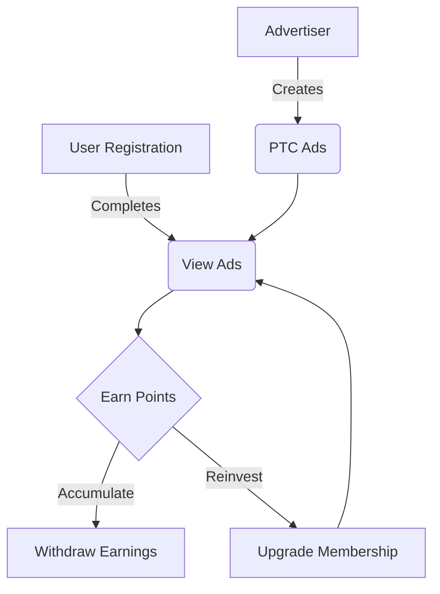

# ptcLAB
ptcLAB is a Laravel Based Script for Pay Per Click business. You can run your own PTC, PPC, or PPV website within a minutes without any programming knowledge.
# ptcLAB - Pay Per Click Platform

ptcLAB is a comprehensive Pay Per Click (PTC) platform built with Laravel. It offers a robust solution for creating and managing a PTC website with advanced features and a user-friendly interface.

## 🚀 Features

### 🛠️ Easy Page Builder
- Fast, intuitive, and smart page builder for quick customization
- Layouts ready for publishing in minutes

### 🔧 Framework
- Built on the latest Laravel Framework

### 📱 Responsive Design
- Fully responsive and retina-ready
- Compatible with all major browsers (IE9+)

### 👥 User Features
- Advanced user panel
- Unique ReCaptcha system
- 21 Payment gateways
- Unlimited withdrawal methods
- Subscription system
- Anti-fraud Pay Per Click
- Real-time logging
- Commissions and level income
- Profile management
- Two-factor authentication (2FA)
- Support ticket system
- SEO-friendly URLs
- Social media integration
- Referral and bonus systems
- Multiple language support

### 👨‍💼 Admin Features
- Secure admin dashboard
- Referral commission & level setup
- Membership plan creator
- PTC ads creator
- User control system
- Deposit and withdrawal management
- Support ticket manager
- Language management
- Plugin handler
- SEO manager
- Email and SMS notification systems
- Template modules with page builder
- Content manager

## 📊 Performance Graph

## 💻 Server Requirements

## 🚀 Installation

1. Upload the script to your server
2. Create a MySQL database
3. Run the installation wizard by accessing your domain
4. Follow the on-screen instructions to complete the setup

## 🆘 Support

For support, please visit: [https://viserlab.com/support](https://viserlab.com/support)

## 📄 License

This project is licensed under the Envato Regular License. See the [LICENSE](LICENSE) file for details.

## 📝 Changelog

### Version 4.0 – 13th June 2024
- Added push notifications
- Added Binance, Aamarpay, and SslCommerz payment gateways
- Improved SEO management for blogs and policy pages
- Enhanced Form Generator with new input types and configurations
- Added automatic system update feature
- Various UI/UX improvements and security patches

[View full changelog](CHANGELOG.md)

## 🙏 Credits

ptcLAB is developed and maintained by [ViserLab](https://codecanyon.net/user/viserlab).

---

**Note:** This is an unofficial repository. For the official version and support, please purchase ptcLAB from [CodeCanyon](https://codecanyon.net/item/ptclab-pay-per-click-platform/28811404).
